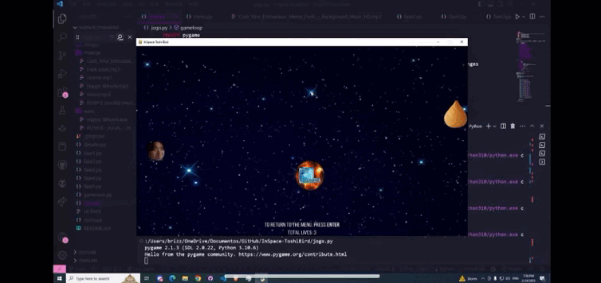

# InSpace Toshi Bird :rocket:

This is a project for the Linear Algebra course at Insper Learning Institute.

### Authors:
- Marcelo Rabello Barranco
- Thomas Chiari Ciocchetti de Souza

### Story:

In this game, you will find the main character, Toshi, who lost his coxinha in space.
To recover it you must reach the targets in space, using your mouse cursor to move, and avoiding the celestial bodies.
The game has five main levels; after you reach the fifth one, you won! However, you can choose to play a challenge level in order to get a giant coxinha.
We will guide you through all the levels, so you can get the coxinha back!

Click on the image below to watch the game trailer:

### How to play:
1. Make sure you have Python 3.9 or higher installed on your computer.
2. Download the repository.
3. Open the terminal and go to the repository folder.
4. Run the command `pip install -r requirements.txt` to install the dependencies.
5. Run the command `python jogo.py` to start the game.
6. Enjoy!

### Controls:
- Mouse Cursor: choose the trajectory of the character
- Mouse Left Click: shoots
- Space Bar: progress the game to the next levels
- Return Key: return to the main menu and restart the game

### Physics:
In order to make the game more realistic, we used vectors and Gravitation Laws to simulate the movement of the characters.
The main character, when moving, is sucked by the gravity of the celestial bodies. This is represented by the vector that points from the character to the celestial body, and calculated using the formulae below:

$$FG = \frac{G M m}{r^2}$$

Where:
- FG is the gravitational force between the character and the celestial body
- G is the gravitational constant
- M is the mass of the celestial body
- m is the mass of the character
- r is the distance between the character and the celestial body, calculated using the Pythagorean theorem

The gravitational force is then used to calculate the acceleration of the character, using the formulae below:

$$a = \frac{F}{m}$$

Where:
- a is the acceleration of the character
- F is the gravitational force between the character and the celestial body
- m is the mass of the character

The acceleration is then used to calculate the velocity of the character, using the formulae below:

$$v = v_0 + at$$

Where:
- v is the velocity of the character
- v0 is the initial velocity of the character
- a is the acceleration of the character

The velocity is then used to calculate the position of the character, using the formulae below:

$$x = x_0 + v$$

Where:
- x is the position of the character
- x0 is the initial position of the character
- v is the velocity of the character

The position is updated at every tick of the game. 
All of these formulae are implemented in the `update_state` function of every level, where we start by calculating the gravitational force between the bodies, followed by calculating the angle between them to calculate the acceleration the character will suffer due to gravity. The character starts at a speed of 20, which varies according to the forces implemented.
